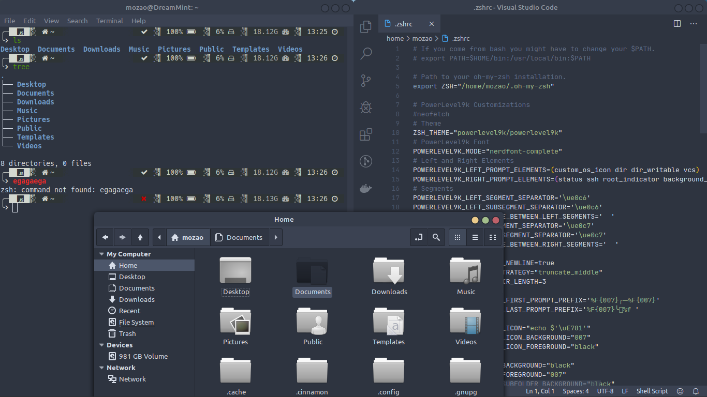
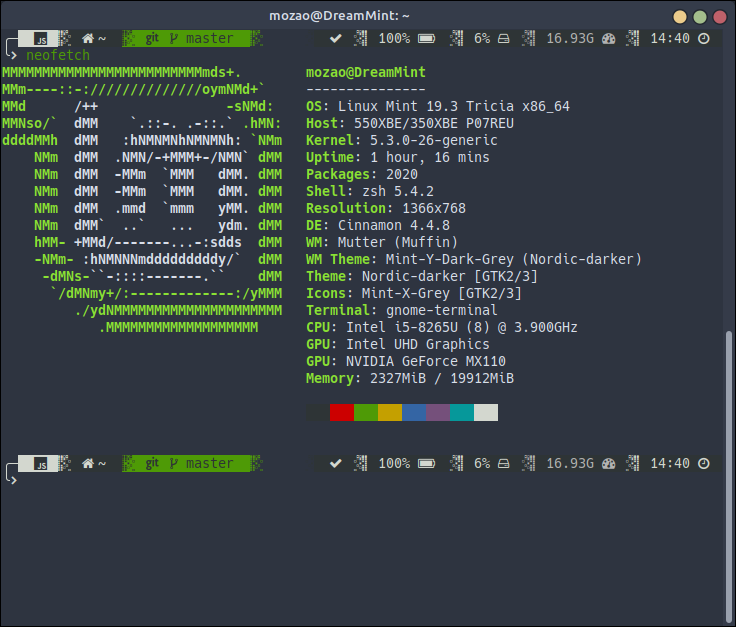
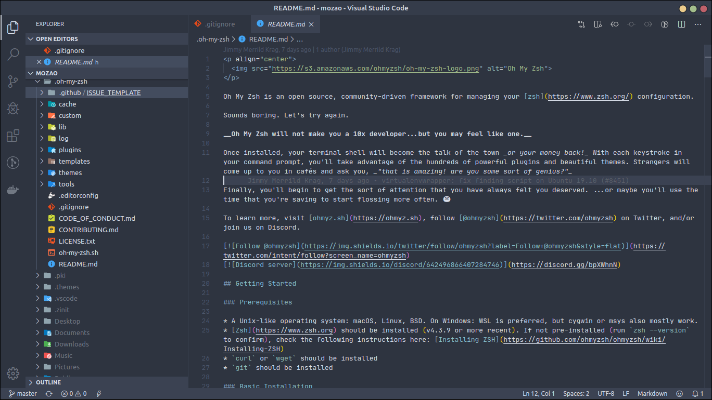

# ~/.dotfiles

---

---

Welcome to Pimp My Shell! This time, featuring [@devMozao](https://twitter.com/devMozao) and his oh-my-zsh config, using [Nord Theme](https://www.nordtheme.com), by Arctic Ice Studio.

---

  

---

  

---

  

---

  

---
